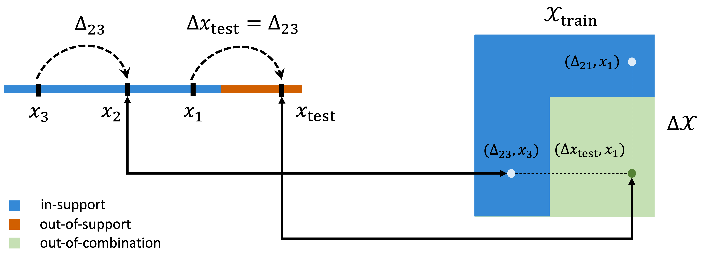

# Learning to Extrapolate: A Transductive Approach
Code for Bilinear Transdcution on regression and imitation learning tasks as proposed in [Learning to Extrapolate: A Transductive Approach](https://arxiv.org/abs/2304.14329)




## Setup
Clone the repository
  ```
  git clone https://github.com/avivne/bilinear-transduction.git
  ```
Create a virtual environment with the following requirements 
  ```
  conda env create -f environment.yml
  ```
Download the [grasping data](https://www.dropbox.com/s/9m8y11abjsa2jgo/demos.pkl?dl=0) and place demos.pkl under data/grasping.


## Training and Evaluation
Training and evaluating bilinear transduction on **regression** tasks (grasping)
  ```
  python bilinear_transduction_regression.py
  ```
Training and evaluating bilinear transduction on **imitation learning** tasks
  ```
  python bilinear_transduction_imitation.py --config-name configs/reach_metaworld.yaml
  ```  
replace `reach_metaworld` with `push_metaworld`, `slider` or `adroit` for other imitation learning environments.
  
Add `--model-type bc` for training and evaluating the neural net baseline on any of the tasks.


## Render Videos
Rendering sample videos of expert demonstrations and model performance on in-distribution and OOS data points
  ```
  python render_videos.py
  ```
modify [this block](https://github.com/avivne/bilinear-transduction/blob/6ab1952cf2471b8fe23387ee1b38abc6bbdd417b/render_videos.py#L92) to render selected environments, models and data points.


## Cite
If you use this code in your research, please consider citing
```
@inproceedings{netanyahu2023transduction,
  title={Learning to Extrapolate: A Transductive Approach},
  author={Netanyahu, Aviv and Gupta, Abhishek and Simchowitz, Max and Zhang, Kaiqing and Agrawal, Pulkit},
  booktitle={The Eleventh International Conference on Learning Representations (ICLR)},
  year={2023}
}
```


# Acknowledgements
The environments and data are derived from [Meta-World](https://arxiv.org/abs/1910.10897), [Adroit relocate](https://arxiv.org/abs/1709.10087), [mjrl](https://github.com/aravindr93/mjrl) and [NDF](https://arxiv.org/abs/2112.05124).
